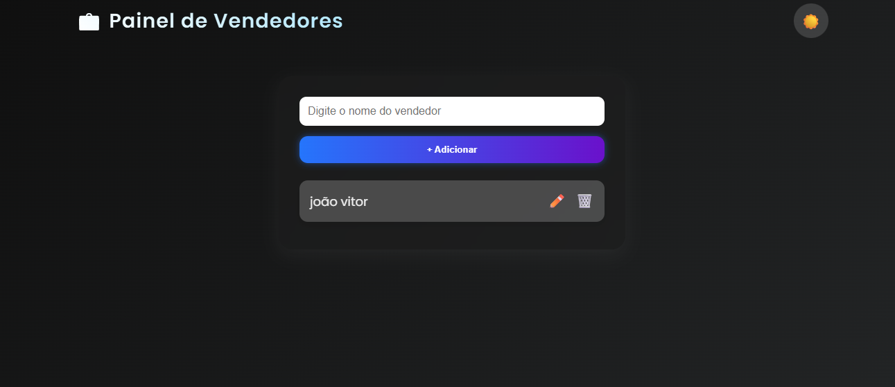

# 💼 Painel de Gerenciamento de Vendedores

Um sistema web moderno desenvolvido com **Python (Flask)**, **HTML5** e **CSS3**, permitindo o cadastro, edição e exclusão de vendedores.  
Conta com **design responsivo**, **modo escuro**, **efeitos animados** e **armazenamento local em JSON**.

---

## 🚀 Tecnologias Utilizadas
- 🐍 **Flask** (framework web Python)
- 🧱 **HTML5 & CSS3**
- 🎨 **Glassmorphism Design**
- 🌙 **Dark/Light Mode**
- 💾 **Armazenamento em JSON**

---

## 🖥️ Demonstração


> Interface moderna com efeito de vidro, botões animados e transições suaves.

---

## ⚙️ Como Rodar o Projeto
1. **Clone o repositório:**
   ```bash
   git clone https://github.com/simonettijv/painel-vendedores-flask.git


